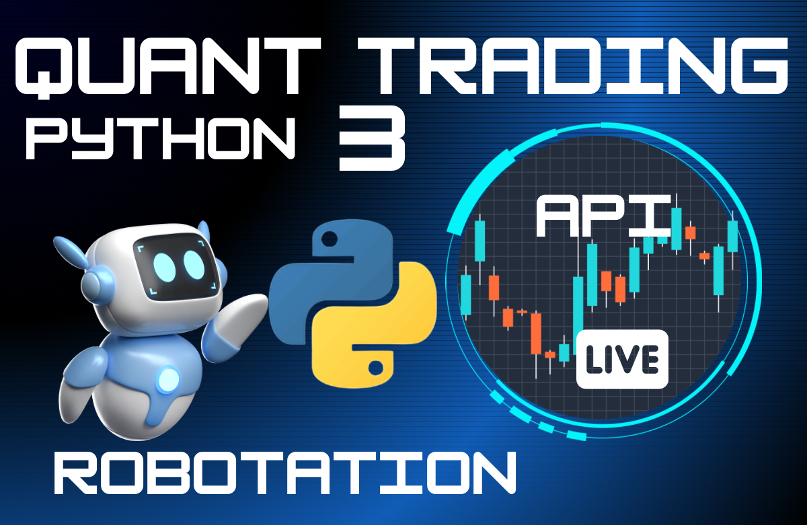

# Pairs Trading Automation



## Description

This repository is a companion for the lecture on Pairs Trading Automation in Azure.

## Course Structure

The course is composed of three main sections:
- **Lecture Part 1**: Pairs Trading Portfolio Creation 
- **Lecture Part 2**: Real-Time Trading with Interactive Brokers API (IBKR TWS API: Trading Workstation) 
- **Lecture Part 3**: IBController and Azure Runbook to Automate Streamlined Trading 

## Environment Setup with Conda

To set up the Python environment, follow these steps:

1. Move to the folder that includes the Conda environment YAML file:
   ```sh
   (base) cd conda-env-yml
   ```
2. Create the Conda environment:
   - **For Windows**:
     ```sh
     (base) conda env create -f myenv-finance.yml
     ```
   - **For macOS**:
     ```sh
     (base) conda env create -f myenv-finance-mac.yml
     ```

## Course Links

### In Korean (detailed explanation):
- [Lecture Part 1](https://inf.run/Vs5xY)
- [Lecture Part 2](https://inf.run/nHguG)
- Lecture Part 3: in preparation

### In English (distilled version):
- Lecture Part 1: YouTube
- Lecture Part 2: YouTube
- Lecture Part 3: YouTube

## Contributing

Contributions to Pairs Trading Automation are always welcome. You can help by:
- Reporting bugs
- Suggesting enhancements
- Sending pull requests

## License

Pairs Trading Automation is licensed under [The GNU General Public License]. You can freely edit and share the contents, but I would appreciate it if you give credit to the original source if you use it for your own projects.

## Contact

If you have any questions, feel free to reach out at [daniel@datatrain.education].
